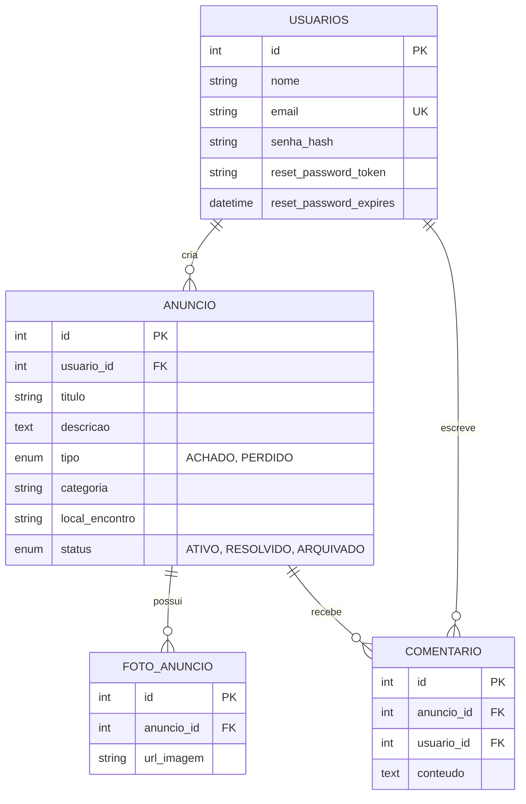

# Modelagem do sistema

> Artefato central da Sprint 3. Os modelos explicam a estrutura e o comportamento do Radar UFLA.

## 1. Modelos selecionados

| Modelo                   | Tipo           | Pergunta que ele ajuda a responder                                       | Requisitos relacionados |
| ------------------------ | -------------- | ------------------------------------------------------------------------ | ----------------------- |
| Diagrama de Sequência    | Comportamental | Como ocorre o fluxo de publicação e validação de anúncios?               | RF-007, RN-004          |
| Diagrama de Classes / ER | Estrutural     | Como as entidades Usuario, Anuncio e FotoAnuncio se relacionam no banco? | RF-001, RF-007, RF-008  |

## 2. Modelo comportamental em Mermaid

### 2.2 Diagrama de Sequência / Atividades (Comportamental)

_(Diagrama do fluxo de publicação de anúncio e validações)_

### 2.3 Diagrama de Classes / MER (Estrutural)

_(Diagrama com as entidades Usuario, Anuncio, FotoAnuncio e Comentario)_

### 2.3 Diagrama de Classes / MER (Estrutural)

O modelo estrutural representa as quatro entidades centrais do domínio "achados e perdidos": **Usuário** (quem publica e comenta), **Anúncio** (o item achado/perdido), **FotoAnuncio** (evidências visuais do item) e **Comentário** (interação entre usuários sobre um anúncio).

Um usuário pode criar vários anúncios e escrever vários comentários (relação 1:N em ambos os casos). Um anúncio, por sua vez, pode ter várias fotos associadas e receber vários comentários. Essa estrutura sustenta diretamente a RF-04 (vitrine pública, que lista os anúncios com seus dados), a RF-07 (cadastro de novo anúncio) e a RF-08 (upload de fotos).

O campo `tipo` do Anúncio (`ACHADO`/`PERDIDO`) e o `status` (`ATIVO`/`RESOLVIDO`/`ARQUIVADO`) controlam o ciclo de vida do item na vitrine. Já a relação Anúncio → FotoAnuncio é o ponto de atenção da **RN-04**, que exige ocultar dados/fotos sensíveis (como documentos) na exibição pública — atualmente o modelo de dados ainda não tem um campo dedicado para marcar uma foto como sensível, o que fica registrado como refinamento pendente para uma próxima sprint.

**Correspondência com o código:**

| Entidade do diagrama | Migration                                           | Model Sequelize          |
| :------------------- | :-------------------------------------------------- | :----------------------- |
| Usuário              | `migrations/20260918000000-create-usuarios.js`      | `models/usuario.js`      |
| Anúncio              | `migrations/20260918000001-create-anuncios.js`      | `models/anuncio.js`      |
| FotoAnuncio          | `migrations/20260918000002-create-fotos-anuncio.js` | `models/foto_anuncio.js` |
| Comentário           | `migrations/20260918000003-create-comentarios.js`   | `models/comentario.js`   |

---

## 3. Matriz de Rastreabilidade

A Matriz de Rastreabilidade abaixo estabelece o elo entre os Requisitos Funcionais (RF), os Requisitos Não-Funcionais (RNF), as Regras de Negócio (RN), as Issues do GitHub, os Diagramas UML e o Código-fonte correspondente.

| ID Requisito / Regra | Descrição Sintética                           | Issue GitHub | Diagrama UML Associado               | Artefato / Código Correspondente                                                   |
| :------------------- | :-------------------------------------------- | :----------- | :----------------------------------- | :--------------------------------------------------------------------------------- |
| **RF-001**           | Cadastro e Autenticação Local (JWT / Bcrypt)  | `#4`         | Diagrama de Casos de Uso / Sequência | `API/Back-End/src/server.js` `API/Back-End/src/migrations/*create-usuarios.js`  |
| **RF-004**           | Vitrine Pública de Achados e Perdidos         | `#1`         | Diagrama de Casos de Uso             | `API/Front-End/index.html` `API/Front-End/app.js`                               |
| **RF-007**           | Cadastrar Novo Anúncio                        | `#2`         | Diagrama de Casos de Uso / Sequência | `API/Back-End/src/migrations/*create-anuncios.js` `API/Front-End/publicar.html` |
| **RF-008**           | Upload de Fotos de Anúncios                   | `#3`         | Diagrama de Classes                  | `API/Back-End/src/migrations/*create-fotos-anuncio.js`                             |
| **RN-004**           | Ocultar dados/fotos sensíveis de "Documentos" | `#2`         | Diagrama de Sequência                | `API/Back-End/src/server.js`                                                       |
| **RNF-001**          | Criptografia de senhas com Bcrypt             | `#4`         | Diagrama de Sequência                | `API/Back-End/src/server.js`                                                       |
