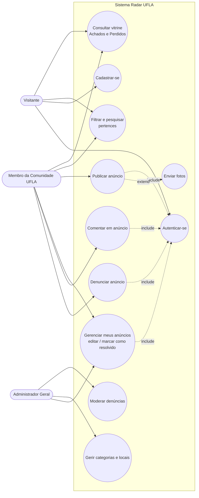
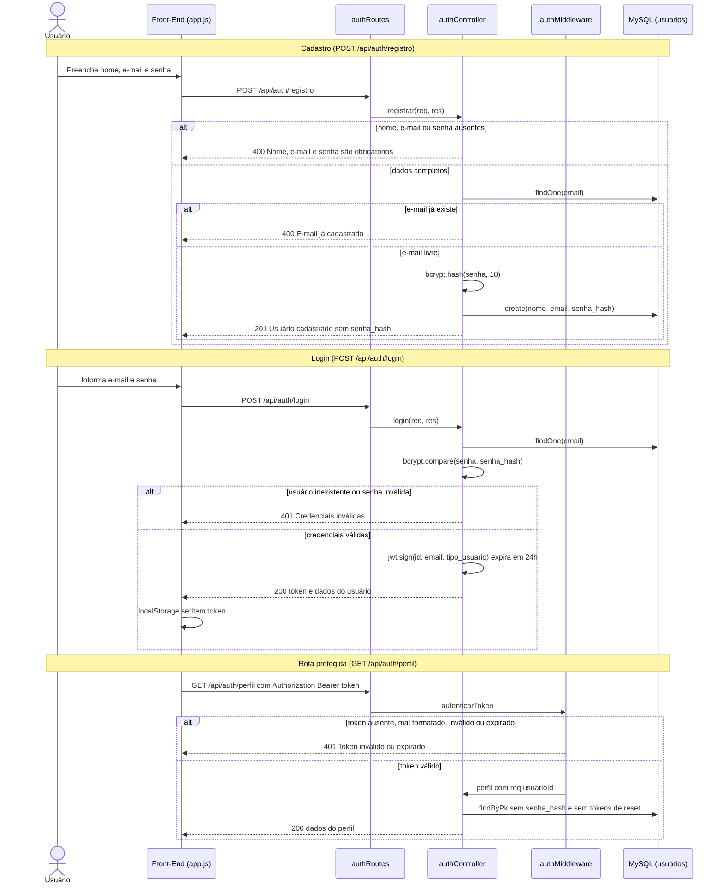
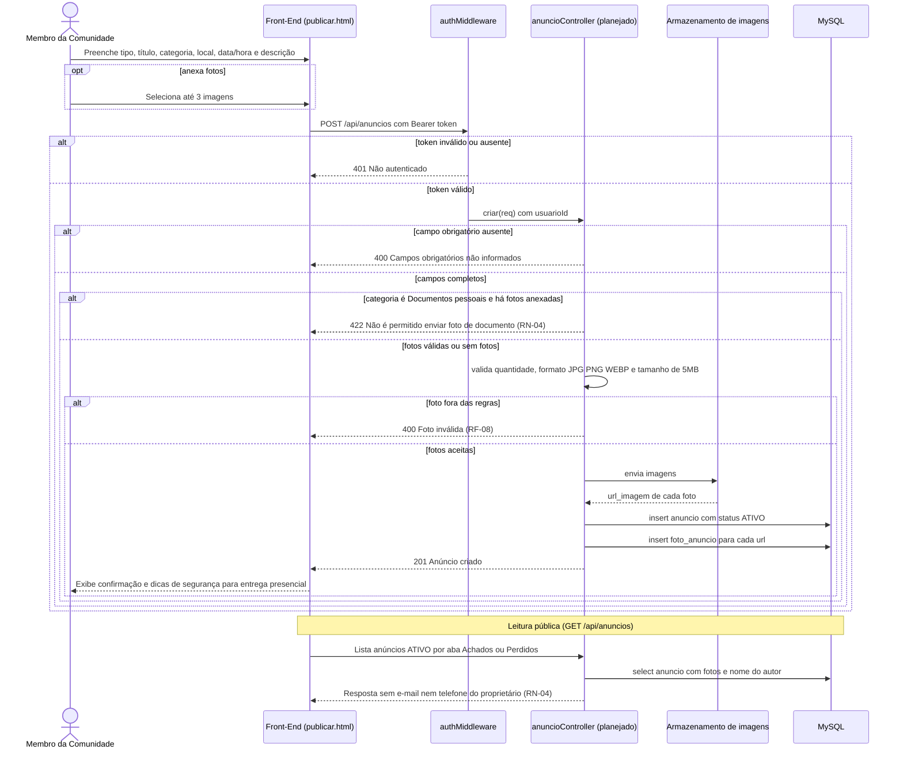
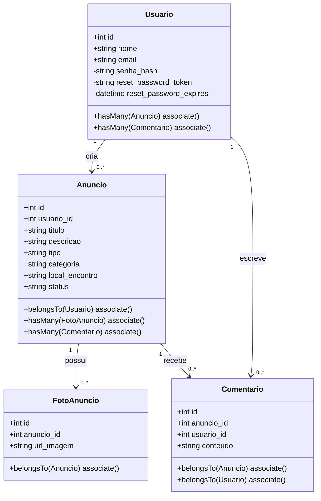
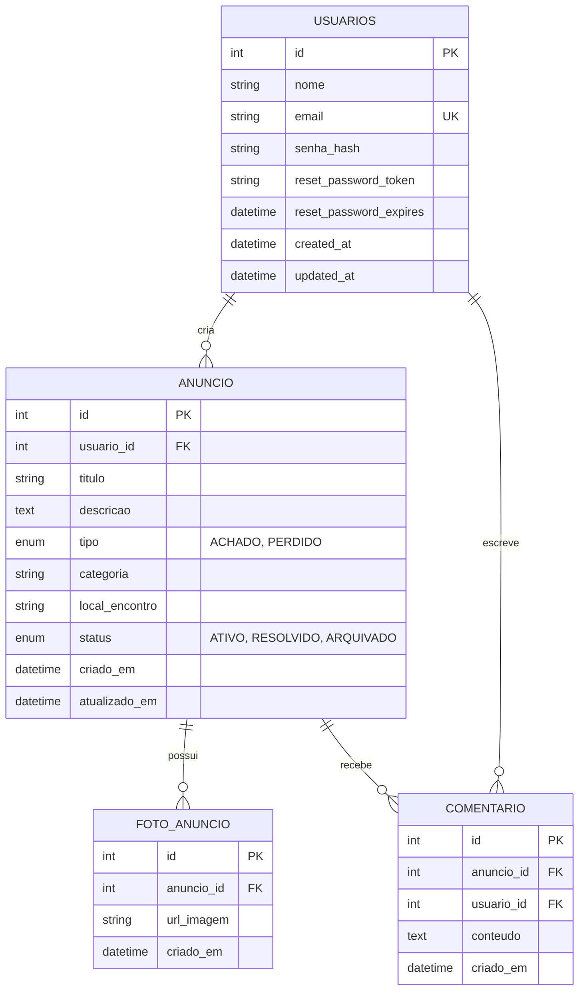
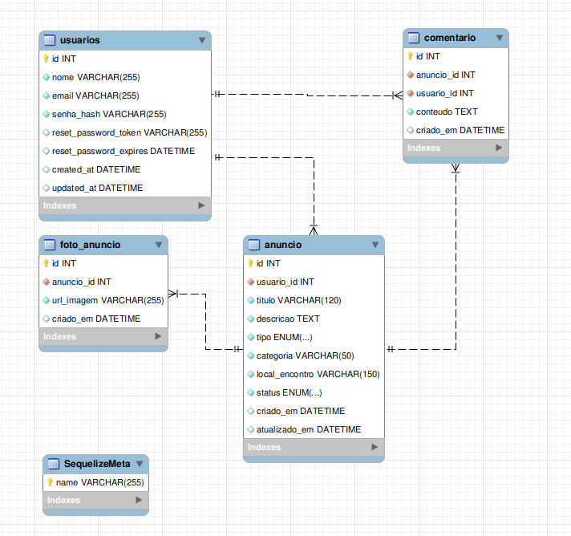
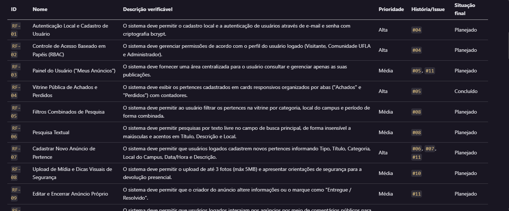
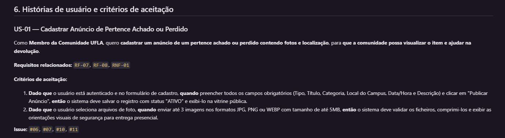

# Modelagem do sistema

> **Artefato central da Sprint 3.** Os modelos explicam a estrutura e o comportamento do **Radar UFLA** (achados e perdidos do campus) e correspondem aos requisitos de [`docs/requisitos/requisitos.md`](../requisitos/requisitos.md) e ao código em [`API/`](../../API/).

**Convenção de identificadores:** este documento usa os mesmos IDs de `requisitos.md` (`RF-01`, `RNF-03`, `RN-04`, `US-01`). As Issues citadas são as do [`backlog-produto.md`](../backlog-produto.md).

**Legenda de situação dos fluxos:** OK implementado no código · WAR modelado, implementação planejada (Issue indicada).

## 1. Modelos selecionados

| Modelo                                                   | Tipo           | Pergunta que ele ajuda a responder                                              | Requisitos relacionados                     |
| -------------------------------------------------------- | -------------- | ------------------------------------------------------------------------------- | ------------------------------------------- |
| Diagrama de Casos de Uso (2.1)                           | Comportamental | Quem são os atores e o que cada um pode fazer no sistema?                       | `RF-01` a `RF-14`, `RF-02`                  |
| Diagrama de Sequência: Cadastro, Login e Perfil (2.2) OK | Comportamental | Como o usuário se cadastra, se autentica e acessa rotas protegidas por JWT?     | `RF-01`, `RF-02`, `RNF-03`                  |
| Diagrama de Sequência: Publicação de Anúncio (2.3) WAR    | Comportamental | Como um anúncio é publicado e onde a regra de dados sensíveis é aplicada?       | `RF-07`, `RF-08`, `RN-04`, `US-01`          |
| Diagrama de Classes UML (3.1) OK                         | Estrutural     | Quais atributos, tipos e métodos cada classe do modelo tem, e como se associam? | `RF-01`, `RF-04`, `RF-07`, `RF-08`, `RF-10` |
| Diagrama Entidade-Relacionamento (3.2) OK                | Estrutural     | Como Usuário, Anúncio, Foto e Comentário se relacionam no banco?                | `RF-01`, `RF-04`, `RF-07`, `RF-08`, `RF-10` |

## 2. Modelos comportamentais

### 2.1 Diagrama de Casos de Uso

O Mermaid não possui notação nativa de casos de uso; o diagrama usa `flowchart` com os atores à esquerda e os casos de uso em elipses. As setas tracejadas `«include»` indicam que um caso de uso depende de outro.

**Descrição e decisões representadas:**

- **Atores** (definidos em `requisitos.md`, seção 2): _Visitante_ (somente leitura e busca), _Membro da Comunidade UFLA_ (autenticado; publica, gerencia os próprios anúncios e comenta) e _Administrador Geral_ (modera e parametriza o sistema).
- Todo caso de uso que altera dados (`Publicar`, `Gerenciar`, `Comentar`, `Denunciar`) **inclui** a autenticação. É essa dependência que justifica o middleware JWT no back-end (ver 2.2).
- `Enviar fotos` é uma **extensão** opcional de `Publicar anúncio`: o anúncio pode existir sem foto, e para a categoria "Documentos pessoais" a foto é proibida (regra `RN-04`, detalhada em 2.3).
- O Administrador também acessa `Gerenciar meus anúncios` porque a `RN-02` permite que o criador **ou** o administrador editem ou encerrem um anúncio.
- O ator "Membro" é especialização do "Visitante": herda tudo que o visitante faz (consultar e pesquisar) e acrescenta as ações autenticadas.

| Caso de uso                     | Requisito        | Situação                                                            |
| ------------------------------- | ---------------- | ------------------------------------------------------------------- |
| Consultar vitrine               | `RF-04`          | OK Layout estático em `index.html`/`app.js`; ainda sem dados da API |
| Filtrar e pesquisar             | `RF-05`, `RF-06` | WAR Issue #8                                                         |
| Cadastrar-se / Autenticar-se    | `RF-01`          | OK Issue #4                                                         |
| Publicar anúncio / Enviar fotos | `RF-07`, `RF-08` | WAR Issues #6, #7, #10, #11                                          |
| Gerenciar meus anúncios         | `RF-03`, `RF-09` | WAR Issue #11                                                        |
| Comentar em anúncio             | `RF-10`          | WAR (modelo de dados pronto)                                         |
| Denunciar / Moderar             | `RF-12`          | WAR Issue #14                                                        |
| Gerir categorias e locais       | `RF-11`          | WAR Issue #9                                                         |

### 2.2 Diagrama de Sequência: Cadastro, Login e Perfil (OK implementado)

**Descrição e decisões representadas:**

- **Senha nunca trafega nem é armazenada em claro:** o hash `bcrypt` (custo 10) é gerado no servidor antes de gravar, e as respostas de cadastro e perfil omitem `senha_hash`, `reset_password_token` e `reset_password_expires` (`RF-01`, `RNF-03`).
- **Mensagem de erro única no login** ("Credenciais inválidas") tanto para e-mail inexistente quanto para senha errada, para não revelar quais e-mails estão cadastrados.
- **Autenticação sem estado (stateless):** o servidor emite um JWT de 24 horas e não guarda sessão; o Front-End guarda o token em `localStorage` e o envia no cabeçalho `Authorization: Bearer`. O `authMiddleware` valida o token e injeta `req.usuarioId` e `req.usuarioTipo` para as rotas seguintes, o que prepara o controle por papéis (`RF-02`).
- Esse mesmo middleware será reutilizado nas rotas de anúncios (2.3).

### 2.3 Diagrama de Sequência: Publicação de Anúncio com validação de RN-04 (WAR planejado)

Este é o fluxo-alvo de `US-01` e ainda **não possui rota no back-end** (`server.js` monta apenas `/api/auth`). Ele é modelado agora para orientar a implementação das Issues #6, #7, #10 e #11.

**Descrição e decisões representadas:**

- **Onde a `RN-04` (LGPD) é aplicada:** em dois pontos do fluxo. (1) _Na entrada:_ a API rejeita foto quando a categoria é "Documentos pessoais", alinhado ao item de backlog Issue #9 ("Documentos pessoais sem foto do documento"). (2) _Na saída:_ a listagem pública devolve apenas os campos do anúncio, as fotos e o nome do autor, nunca e-mail, telefone ou outros dados de contato. A combinação evita depender de análise de imagem, que está fora do escopo (`requisitos.md`, seção 7).
- **Ordem das validações:** autenticação → campos obrigatórios → regra `RN-04` → regras de foto (`RF-08`: até 3 arquivos, JPG/PNG/WEBP, até 5 MB) → persistência. As regras de negócio vêm antes do upload para não enviar arquivos ao armazenamento que serão descartados.
- **Persistência:** o anúncio nasce com `status = ATIVO` (critério de aceitação 1 de `US-01`) e cada foto vira uma linha de `foto_anuncio` ligada ao anúncio.
- **Decisão em aberto para o grupo:** o model `FotoAnuncio` traz comentado o campo `contem_dado_sensivel`. A abordagem escolhida acima (proibir foto na categoria de documentos) dispensa o campo. Se o grupo preferir permitir foto com tarja, o campo e uma nova migration passam a ser necessários (ver seção 6).

## 3. Modelos estruturais: Diagrama de Classes UML e Diagrama Entidade-Relacionamento

### 3.1 Diagrama de Classes UML

O Diagrama de Classes espelha os models Sequelize em `API/Back-End/src/models/`: os atributos privados (`-`) são os campos que nunca aparecem nas respostas da API (seção 2.2), e os métodos `associate()` correspondem às declarações `hasMany`/`belongsTo` de cada arquivo. As cardinalidades e as classes são as mesmas do Diagrama Entidade-Relacionamento (3.2), que detalha a estrutura física das tabelas.

### 3.2 Diagrama Entidade-Relacionamento

**Descrição e decisões representadas:**

- **Entidades:** _Usuário_ (quem publica e comenta), _Anúncio_ (o item achado ou perdido), _FotoAnuncio_ (evidência visual do item) e _Comentário_ (interação pública para combinar a devolução, `RF-10`).
- **Relacionamentos (todos 1:N):** um usuário cria muitos anúncios e escreve muitos comentários; um anúncio possui muitas fotos e recebe muitos comentários. Todas as chaves estrangeiras usam `ON DELETE CASCADE`: excluir um anúncio remove suas fotos e comentários, e excluir um usuário remove seus anúncios e comentários.
- **Um único tipo de anúncio:** "Achado" e "Perdido" são o mesmo conceito com o atributo `tipo`, o que permite alternar as abas da vitrine (`RF-04`) com a mesma consulta e o mesmo formulário (`RF-07`).
- **Ciclo de vida:** `status` inicia em `ATIVO` e evolui para `RESOLVIDO` (`RF-09`) ou `ARQUIVADO`. Os índices `idx_anuncio_tipo_status` e `idx_anuncio_usuario_id` sustentam a consulta da vitrine e da área "Meus anúncios" (`RF-03`).
- **Segurança de dados:** `senha_hash` guarda apenas o hash bcrypt (`RNF-03`), e `email` é único (`UK`), condição usada na verificação de duplicidade do cadastro.

## 4. Relação entre requisitos e modelos

| Requisito  | Descrição Sintética                           | Issue GitHub                    | Diagrama UML Associado        | Artefato / Código-Fonte Correspondente                                                                                                                    |
| :--------- | :-------------------------------------------- | :------------------------------ | :---------------------------- | :-------------------------------------------------------------------------------------------------------------------------------------------------------- |
| **RF-01**  | Autenticação Local e Cadastro (JWT / Bcrypt)  | `#4`              | Casos de Uso / Sequência      | `API/Back-End/src/controllers/authController.js` `API/Back-End/src/middlewares/authMiddleware.js` `API/Back-End/src/migrations/*create-usuarios.js` |
| **RF-02**  | Controle de Acesso Baseado em Papéis (RBAC)   | `#4`                   | Casos de Uso                  | `API/Back-End/src/middlewares/authMiddleware.js`                                                                                                          |
| **RF-04**  | Vitrine Pública de Achados e Perdidos         | `#5`                  | Casos de Uso / ER             | `API/Front-End/index.html` `API/Front-End/app.js`                                                                                                      |
| **RF-07**  | Cadastrar Novo Anúncio                        | `#6`, `#7`, `#11` | Casos de Uso / Sequência / ER | `API/Front-End/publicar.html` `API/Back-End/src/models/anuncio.js` `API/Back-End/src/migrations/*create-anuncios.js`                                |
| **RF-08**  | Upload de Fotos de Anúncios                   | `#10`               | Diagrama ER                   | `API/Back-End/src/models/foto_anuncio.js` `API/Back-End/src/migrations/*create-fotos-anuncio.js`                                                       |
| **RF-10**  | Seção de Comentários no Anúncio               | `#11`                  | Casos de Uso / ER             | `API/Back-End/src/models/comentario.js` `API/Back-End/src/migrations/*create-comentarios.js`                                                           |
| **RN-04**  | Ocultar dados/fotos de "Documentos" (LGPD)    | `#9`                   | Diagrama de Sequência         | `API/Front-End/app.js` `API/Front-End/publicar.html` `API/Back-End/src/models/foto_anuncio.js`                                                      |
| **RNF-01** | Interface Responsiva e Identidade Visual UFLA | `#5`                            | Casos de Uso                  | `API/Front-End/styles.css`                                                                                                                                |
| **RNF-03** | Segurança e Hash de Senhas (Bcrypt / JWT)     | `#4`              | Diagrama de Sequência         | `API/Back-End/src/controllers/authController.js`                                                                                                          |
| **RNF-06** | Arquitetura Cliente-Servidor e Docker         | `#2`, `#3`                      | Diagrama ER                   | `API/Back-End/docker-compose.yml` `API/Back-End/Dockerfile`                                                                                            |

## 5. Correspondência entre modelo e código

| Elemento modelado                | Arquivo/diretório correspondente                                                                                                                                                                           | Observação                                                          |
| -------------------------------- | ---------------------------------------------------------------------------------------------------------------------------------------------------------------------------------------------------------- | ------------------------------------------------------------------- |
| Entidade `USUARIOS`              | [`migrations/20260918000000-create-usuarios.js`](../../API/Back-End/src/migrations/20260918000000-create-usuarios.js), [`models/usuario.js`](../../API/Back-End/src/models/usuario.js)                     | Corresponde ao ER; ver divergência do controller na seção 6, item 1 |
| Entidade `ANUNCIO`               | [`migrations/20260918000001-create-anuncios.js`](../../API/Back-End/src/migrations/20260918000001-create-anuncios.js), [`models/anuncio.js`](../../API/Back-End/src/models/anuncio.js)                     | Inclui índices por `usuario_id` e por `tipo, status`                |
| Entidade `FOTO_ANUNCIO`          | [`migrations/20260918000002-create-fotos-anuncio.js`](../../API/Back-End/src/migrations/20260918000002-create-fotos-anuncio.js), [`models/foto_anuncio.js`](../../API/Back-End/src/models/foto_anuncio.js) | `contem_dado_sensivel` está apenas comentado no model               |
| Entidade `COMENTARIO`            | [`migrations/20260918000003-create-comentarios.js`](../../API/Back-End/src/migrations/20260918000003-create-comentarios.js), [`models/comentario.js`](../../API/Back-End/src/models/comentario.js)         | Sem coluna de atualização (`updatedAt: false`)                      |
| Associações 1:N do ER            | [`models/index.js`](../../API/Back-End/src/models/index.js) e métodos `associate` de cada model                                                                                                            | `hasMany`/`belongsTo` espelham os relacionamentos do diagrama       |
| Sequência 2.2 (cadastro e login) | [`controllers/authController.js`](../../API/Back-End/src/controllers/authController.js), [`routes/authRoutes.js`](../../API/Back-End/src/routes/authRoutes.js)                                             | Funções `registrar`, `login` e `perfil`                             |
| Sequência 2.2 (JWT)              | [`middlewares/authMiddleware.js`](../../API/Back-End/src/middlewares/authMiddleware.js)                                                                                                                    | Valida `Bearer`, injeta `req.usuarioId` e `req.usuarioTipo`         |
| Sequência 2.2 (cliente)          | [`API/Front-End/app.js`](../../API/Front-End/app.js), [`login.html`](../../API/Front-End/login.html), [`registro.html`](../../API/Front-End/registro.html)                                                 | `fetch` para `/api/auth/*` e `localStorage.setItem("token")`        |
| Ponto de entrada da API          | [`server.js`](../../API/Back-End/src/server.js)                                                                                                                                                            | Monta apenas `/api/auth`; ainda não monta rotas de anúncios         |
| Sequência 2.3 (publicação)       | [`API/Front-End/publicar.html`](../../API/Front-End/publicar.html)                                                                                                                                         | Somente o formulário; sem controller/rota correspondente (WAR)       |
| Casos de uso: vitrine            | [`API/Front-End/index.html`](../../API/Front-End/index.html), [`app.js`](../../API/Front-End/app.js)                                                                                                       | Feed com abas; dados ainda locais                                   |

## 6. Refinamentos identificados

A modelagem revelou lacunas entre requisitos, modelos e código. Cada item deve virar Issue no backlog.

1. **`tipo_usuario` e `telefone` não existem no banco.** O `authController.registrar` lê e devolve esses dois campos, mas a migration e o model de `Usuario` não os possuem; o papel nunca é gravado e o JWT sai com `tipo_usuario` indefinido. Isso bloqueia o `RF-02` (papéis) e a `RN-02`. _Ação:_ nova migration (`tipo_usuario` com valores comum/admin e `telefone` opcional) e atualização do model. O telefone é dado pessoal e, pela `RN-04`, nunca deve aparecer na listagem pública.
2. **Anúncio sem data/hora e com status incompletos.** O `RF-07` exige "Data/Hora" do achado/perda, mas `ANUNCIO` não tem esse campo; e o `status` só aceita `ATIVO`, `RESOLVIDO`, `ARQUIVADO`, enquanto `RN-01` e `RN-03` exigem `EM_QUARENTENA` e `EXPIRADO`. _Ação:_ migration para `data_ocorrencia` e ampliação do enum.
3. **Categoria e local são texto livre.** O `RF-11` pede categorias e locais gerenciados pelo administrador e o `RF-05` filtra por eles. _Ação:_ avaliar entidades `Categoria` e `Local` com chave estrangeira em `ANUNCIO`.
4. **Regra de foto sensível (`RN-04`).** Decisão adotada no diagrama 2.3: proibir foto na categoria "Documentos pessoais". Alternativa (permitir foto com tarja) exigiria o campo `contem_dado_sensivel` e migration. _Ação:_ grupo confirmar a abordagem.
5. **Falta a entidade `Denuncia`** (`RF-12`, `RN-01`): usuário denunciante, anúncio e data, com restrição de uma denúncia por usuário por anúncio para a contagem de 3 denúncias distintas.
6. **Rotas de anúncios inexistentes.** `server.js` só expõe `/api/auth`; `publicar.html` e `index.html` ainda não consomem a API. _Ação:_ implementar o fluxo 2.3 (Issues #6, #7, #10, #11) e ligar a vitrine (Issue #5).
7. **Padronização de nomes de tabela.** `usuarios` está no plural e as demais no singular; registrar como decisão de projeto na Sprint 4 (renomear ou documentar a convenção).
8. **Correção de identificadores.** A versão anterior deste documento usava `RF-001`/`RN-004`/`RNF-001`, fora do padrão de `requisitos.md`, e associava a criptografia de senha ao `RNF-001`; o correto é `RNF-03`. Também citava Issues que não correspondem ao backlog. Tudo foi corrigido nesta versão.

## 7. Histórico de atualização

| Sprint   | Modelo alterado                                                                                                              | Motivo                                                  | Evidência                     |
| -------- | ---------------------------------------------------------------------------------------------------------------------------- | ------------------------------------------------------- | ----------------------------- |
| Sprint 3 | ER (3): campos `created_at`/`updated_at`/`criado_em`, cardinalidades e `ON DELETE CASCADE` descritos; alinhado às migrations | Garantir correspondência exata entre modelo e código    |   |
| Sprint 3 | Seções 4 e 5: matriz reescrita com IDs de `requisitos.md`, Issues do backlog e arquivos reais                                | IDs e Issues da versão anterior estavam inconsistentes  | |
| Sprint 3 | `requisitos.md`: itens de refinamento da seção 6 a registrar (papéis, data/hora, status, `Denuncia`)                         | Modelagem revelou lacunas nos requisitos                |   |
