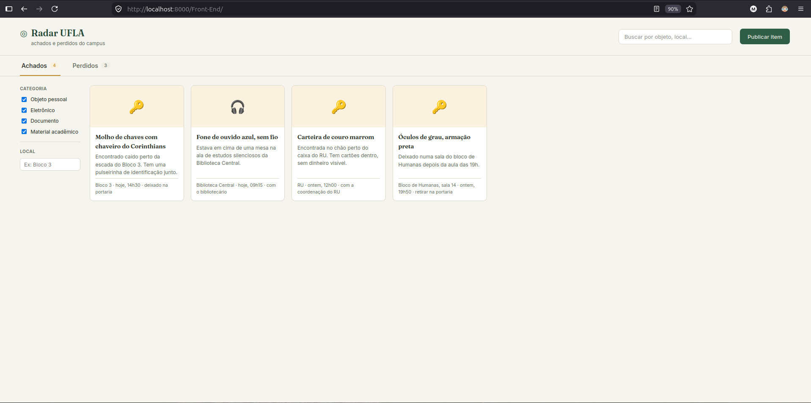
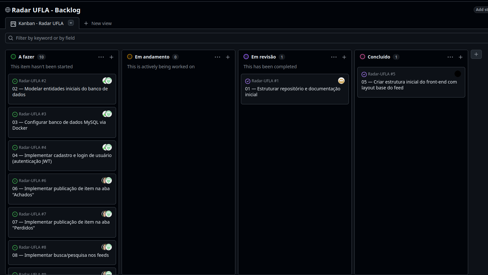

# Sprint 1 — Problema, visão do produto e organização inicial

- **Data de entrega:** 24/08/2026
- **Pontuação:** 2,5 pontos
- **Tag obrigatória:** `sprint-01`
- **Responsável por conferir este arquivo:** Luis Gustavo Borges Vilela Marques (@Luis-Marques06)

## 1. Pergunta que esta sprint deve responder

**Qual problema será tratado, quem é afetado e qual produto o grupo pretende desenvolver?**

## 2. Objetivo e resultado da sprint

**Objetivo planejado:** Definir com precisão o problema de achados e perdidos na UFLA, estabelecer a visão inicial do produto (Radar UFLA) e criar a estrutura mínima de trabalho no GitHub (repositório, documentação inicial, Project e backlog), além de uma primeira estrutura executável da aplicação.

**Resultado efetivamente alcançado:** Toda a documentação central foi criada (README, visão geral, backlog do produto) e a estrutura de pastas do repositório segue o padrão exigido. O GitHub Project foi configurado com 12 itens no Product Backlog. O incremento mínimo da aplicação também foi entregue: uma estrutura de front-end navegável (feed com abas Achados/Perdidos, filtros, busca e página de publicação), ainda sem integração com back-end. O grupo iniciou os trabalhos com atraso em relação ao cronograma original, o que concentrou parte dos commits desta etapa em um único integrante — ponto de atenção registrado na retrospectiva (seção 8).

## 3. Checklist do artefato central — 0,75 ponto

**Entrega esperada:** `README.md`, `docs/visao-geral.md`, `docs/backlog-produto.md` e GitHub Project com pelo menos dez itens descritos e priorizados.

- [x] Problema delimitado, com público e contexto identificados.
- [x] Proposta de valor, objetivos e limites iniciais definidos.
- [x] Integrantes e organização de trabalho registrados.
- [x] GitHub Project criado e linkado.
- [x] Issues iniciais com prioridade, responsável e critério de aceitação.

### Links dos artefatos

| Artefato criado/atualizado | Link na tag da sprint                                                                                           | O que mudou                                                                       |
| -------------------------- | --------------------------------------------------------------------------------------------------------------- | --------------------------------------------------------------------------------- |
| README.md                  | [README](https://github.com/Matheus-Castro-Paula/Radar-UFLA/blob/sprint-01/README.md)                           | Criação do README com problema, integrantes, tecnologias e instruções de execução |
| docs/visao-geral.md        | [Visão Geral](https://github.com/Matheus-Castro-Paula/Radar-UFLA/blob/sprint-01/docs/visao-geral.md)            | Criação da visão do produto (problema, stakeholders, escopo)                      |
| docs/backlog-produto.md    | [Backlog do Produto](https://github.com/Matheus-Castro-Paula/Radar-UFLA/blob/sprint-01/docs/backlog-produto.md) | Criação do documento de backlog vinculado ao GitHub Project                       |

## 4. Incremento da aplicação web — 0,75 ponto

**Incremento mínimo esperado:** Estrutura inicial em `src/`, instruções de execução e ao menos uma página/estrutura executável ou protótipo navegável.

### O que foi implementado ou evoluído

Foi criada a estrutura inicial do front-end (HTML, CSS e JavaScript puros), com:

- Página de feed (`index.html`) com abas "Achados"/"Perdidos", contadores, busca por texto, filtros por categoria e local, e itens de exemplo (dados fixos no código, sem back-end ainda);
- Página própria de publicação (`publicar.html`), com seleção do tipo de item, categoria, e ocultação automática da área de upload quando a categoria é "Documento" (regra de proteção de dados definida na visão geral);
- Estilo visual próprio (`styles.css`) e lógica de interação (`app.js`).

Ainda não há integração com back-end, banco de dados ou autenticação — previsto para a Sprint 2.

### Como executar e verificar

```bash
git clone https://github.com/Matheus-Castro-Paula/Radar-UFLA.git
cd Radar-UFLA

# Linux/Mac
python3 -m http.server 8000 --directory src/Front-End

# Windows
python -m http.server 8000 --directory src/Front-End
```

Depois, acessar `http://localhost:8000` no navegador.

| Requisito/Issue            | Código ou protótipo                                                                                                  | Evidência de execução                                               |
| -------------------------- | -------------------------------------------------------------------------------------------------------------------- | ------------------------------------------------------------------- |
| `#5` (estrutura Front-end) | [Commit 79ac6af](https://github.com/Matheus-Castro-Paula/Radar-UFLA/commit/79ac6af398e8be9e320be7e54565bd04ab067320) |  |

## 5. Scrum e gestão do trabalho — 0,50 ponto

### Sprint Backlog

| Issue                                                               | Descrição                                     | Responsável                    | Critério de aceitação/conclusão                   | Situação     |
| ------------------------------------------------------------------- | --------------------------------------------- | ------------------------------ | ------------------------------------------------- | ------------ |
| [#1](https://github.com/Matheus-Castro-Paula/Radar-UFLA/issues/1)   | Estruturar repositório e documentação inicial | Luis Gustavo (@Luis-Marques06) | README, visão-geral e backlog-produto preenchidos | Concluída    |
| [#2](https://github.com/Matheus-Castro-Paula/Radar-UFLA/issues/2)   | Modelar entidades iniciais do banco de dados  | Matheus Castro/Arthur Ramos    | Entidades e relacionamentos definidos             | Pendente     |
| [#3](https://github.com/Matheus-Castro-Paula/Radar-UFLA/issues/3)   | Configurar banco de dados MySQL via Docker    | Matheus Castro/Arthur Ramos    | Banco sobe com `docker compose up`                | Pendente     |
| [#4](https://github.com/Matheus-Castro-Paula/Radar-UFLA/issues/4)   | Cadastro e login de usuário (JWT)             | Matheus Castro/Arthur Ramos    | Rotas de cadastro e login funcionais              | Pendente     |
| [#5](https://github.com/Matheus-Castro-Paula/Radar-UFLA/issues/5)   | Estrutura inicial do front-end                | Rodrigo (@rodrigopenha13)      | Página inicial navegável com as duas abas         | Concluída    |
| [#12](https://github.com/Matheus-Castro-Paula/Radar-UFLA/issues/12) | Instruções de instalação e execução           | Luis Gustavo (@Luis-Marques06) | Seção "Como executar" do README preenchida        | Em andamento |

### Acompanhamento

- **GitHub Project:** [Projects](https://github.com/users/Matheus-Castro-Paula/projects/2)
- **Reuniões/decisões:** O grupo não mantém uma pasta formal de atas; os encontros são registrados diretamente aqui. Houve um encontro presencial (data não registrada com precisão, poucos dias antes do fechamento desta sprint) para definir o problema e o nome do projeto, e duas chamadas de voz no Discord dedicadas ao trabalho: uma para decidir a stack técnica e os papéis de cada integrante, e outra para revisar as Issues e organizar o backlog.
- **Impedimentos:** Nenhum impedimento técnico. O principal ponto de atenção foi o atraso do grupo em iniciar os trabalhos em relação ao cronograma da disciplina.
- **Mudanças de escopo:** Nenhuma até o momento.

## 6. GitHub, documentação e rastreabilidade — 0,50 ponto

| Tipo de evidência       | Link                                                                                                                                                                                                                                                                                                                                                                                                                                                                                                                                                                           | O que comprova                                                                                                                  |
| ----------------------- | ------------------------------------------------------------------------------------------------------------------------------------------------------------------------------------------------------------------------------------------------------------------------------------------------------------------------------------------------------------------------------------------------------------------------------------------------------------------------------------------------------------------------------------------------------------------------------ | ------------------------------------------------------------------------------------------------------------------------------- |
| Issue                   | [Issues](https://github.com/Matheus-Castro-Paula/Radar-UFLA/issues)                                                                                                                                                                                                                                                                                                                                                                                                                                                                                                            | 12 Issues criadas com labels de tipo, prioridade e área                                                                         |
| Pull Request            | — (não utilizado nesta sprint; grupo ainda não trabalha com branches/PRs)                                                                                                                                                                                                                                                                                                                                                                                                                                                                                                      | —                                                                                                                               |
| Commit                  | [79ac6af](https://github.com/Matheus-Castro-Paula/Radar-UFLA/commit/79ac6af398e8be9e320be7e54565bd04ab067320)                                                                                                                                                                                                                                                                                                                                                                                                                                                                  | Criação da estrutura inicial do front-end (commit por Matheus, código de autoria de Rodrigo e Bernardo — ver observação abaixo) |
| Código/arquivo          | [src/Front-End/index.html](https://github.com/Matheus-Castro-Paula/Radar-UFLA/blob/79ac6af398e8be9e320be7e54565bd04ab067320/src/Front-End/index.html), [publicar.html](https://github.com/Matheus-Castro-Paula/Radar-UFLA/blob/79ac6af398e8be9e320be7e54565bd04ab067320/src/Front-End/publicar.html), [styles.css](https://github.com/Matheus-Castro-Paula/Radar-UFLA/blob/79ac6af398e8be9e320be7e54565bd04ab067320/src/Front-End/styles.css), [app.js](https://github.com/Matheus-Castro-Paula/Radar-UFLA/blob/79ac6af398e8be9e320be7e54565bd04ab067320/src/Front-End/app.js) | Estrutura executável da aplicação                                                                                               |
| Teste/captura/relatório |                                                                                                                                                                                                                                                                                                                                                                                                                                                                                                                       | Captura de tela do estado atual do GitHub Projects                                                                              |

> **Observação sobre autoria:** o commit acima foi realizado pela conta de Matheus, mas o código foi escrito por Rodrigo e Bernardo. O grupo está ciente de que o regulamento exige commits verificáveis de cada aluno e vai corrigir esse padrão a partir de agora.

### Rastreabilidade resumida

| Requisito            | Issue      | Artefato/modelo/decisão                      | Código             | Teste/evidência         |
| -------------------- | ---------- | -------------------------------------------- | ------------------ | ----------------------- |
| A definir (Sprint 2) | `#1`–`#12` | docs/visao-geral.md, docs/backlog-produto.md | `src/` (front-end) | `[ainda não aplicável]` |

## 7. Revisão do incremento

- **O que foi demonstrado:** Repositório estruturado, documentação central completa, backlog priorizado, Project configurado e front-end navegável (feed, busca, filtros e página de publicação).
- **Critérios atendidos:** Artefato central da Sprint 1 e incremento mínimo da aplicação web (estrutura executável em `src/`).
- **Itens não concluídos:** Modelagem de entidades (#2), configuração do banco via Docker (#3) e autenticação (#4) — previstos para avançar já na Sprint 2, junto com a definição formal dos requisitos.
- **Motivo das pendências:** O grupo iniciou os trabalhos com atraso em relação ao cronograma da disciplina, priorizando primeiro consolidar a documentação e a organização do Scrum, e em seguida o incremento de front-end.
- **Feedback recebido e ajustes:** —

## 8. Retrospectiva e próxima sprint

- **Funcionou bem:** Definição clara do problema e do escopo inicial; boa divisão de papéis no grupo; incremento de front-end entregue mesmo com o atraso inicial.
- **Precisa melhorar:** Concentração de commits em um único integrante — os demais colaboraram na definição e até na escrita do código (front-end), mas isso não ficou registrado como commit próprio de cada um no Git.
- **Ação concreta para a próxima sprint:** Cada integrante deve realizar seus próprios commits diretamente, mesmo quando o trabalho for colaborativo (ex: pair programming), para que a autoria fique corretamente registrada no histórico do repositório.

## 9. O que não será considerado suficiente

- Tema genérico sem delimitação do problema.
- Backlog composto apenas por títulos vagos.
- Repositório apenas com documentos, sem estrutura inicial da aplicação.

## 10. Links enviados no UFLA Virtual

- **Tag `sprint-01`:** [Sprint 01](https://github.com/Matheus-Castro-Paula/Radar-UFLA/tree/sprint-01)
- **Este arquivo na tag:** [sprint-01.md](https://github.com/Matheus-Castro-Paula/Radar-UFLA/blob/sprint-01/docs/sprints/sprint-01.md)
- **Observação adicional:** O incremento de código desta sprint foi commitado por um único integrante (Matheus), ainda que a autoria do código seja compartilhada com Rodrigo e Bernardo; o grupo já identificou esse ponto e ajustará o processo de commits a partir da Sprint 2.
