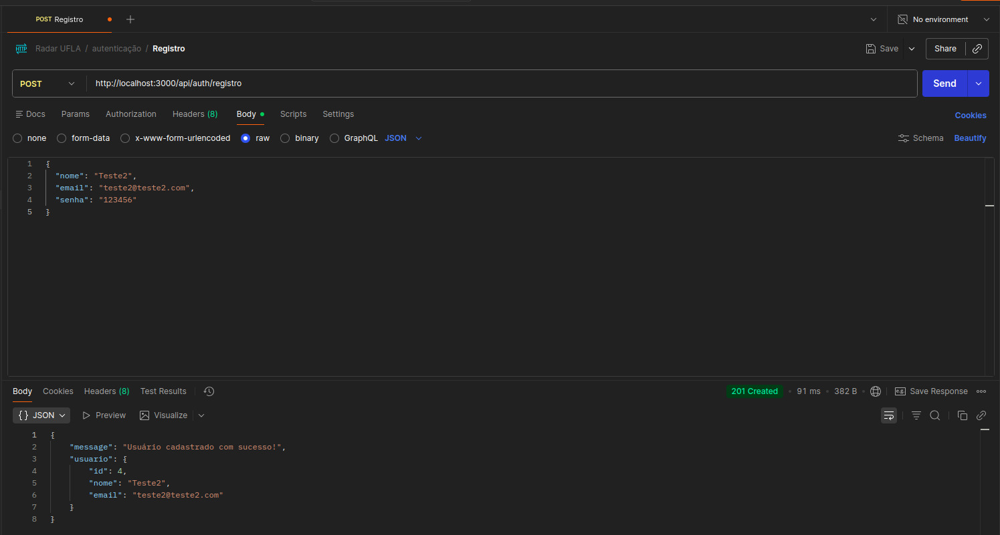
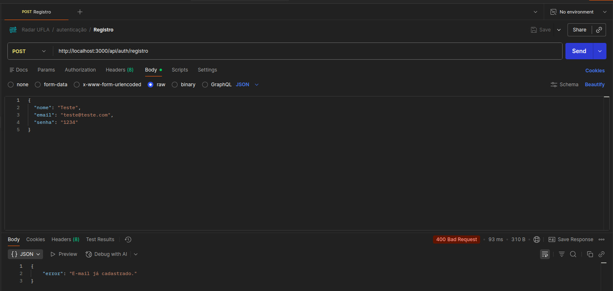
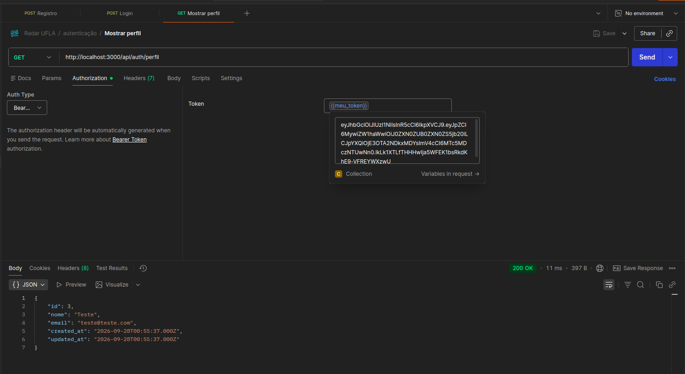
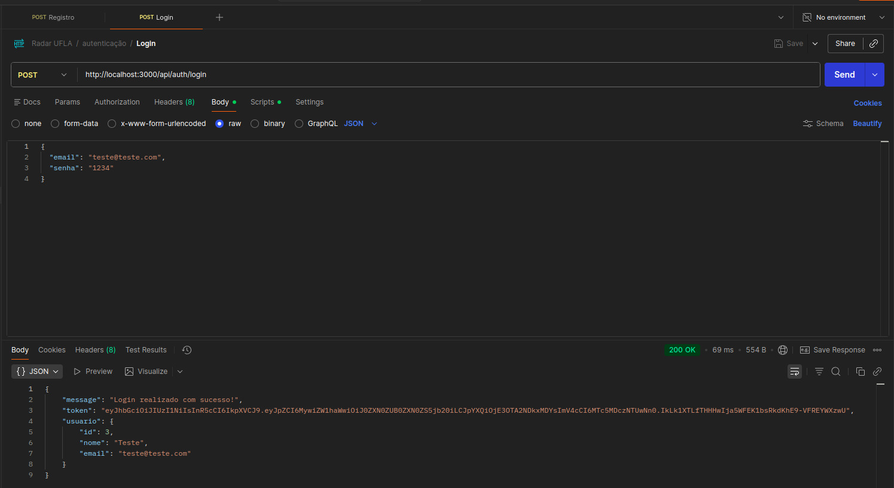

# Sprint 3 — Modelagem e rastreabilidade dos requisitos

- **Data de entrega:** 28/09/2026
- **Pontuação:** 2,5 pontos
- **Tag obrigatória:** `sprint-03`
- **Responsável por conferir este arquivo:** Luis Gustavo Borges Vilela Marques (@Luis-Marques06)

## 1. Pergunta que esta sprint deve responder

**Como a estrutura e os principais fluxos do sistema são representados?**

## 2. Objetivo e resultado da sprint

**Objetivo planejado:** Modelar a estrutura de dados do Radar UFLA (Diagrama de Classes / MER) e seus fluxos principais, ligar os modelos aos requisitos e ao código por meio de uma Matriz de Rastreabilidade e implementar a autenticação local com JWT e criptografia de senhas no Back-End, consumida pelo Front-End.

**Resultado efetivamente alcançado:** O Diagrama MER (Mermaid) das quatro entidades (`Usuario`, `Anuncio`, `FotoAnuncio` e `Comentario`) e a Matriz de Rastreabilidade foram consolidados em `docs/modelagem/modelagem.md`. No código, o Back-End passou a ter o mapeamento ORM completo (Sequelize Models com associações), o fluxo de autenticação (`POST /api/auth/registro`, `POST /api/auth/login` e a rota protegida `GET /api/auth/perfil`) com `bcryptjs` e `jsonwebtoken`, um middleware de verificação de token e um seeder de usuário demo. No Front-End, foram criadas as páginas `login.html` e `registro.html`, integradas à API via `fetch()`, com o token JWT salvo no `localStorage`.

## 3. Checklist do artefato central — 0,75 ponto

**Entrega esperada:** `docs/modelagem/modelagem.md`, ao menos um modelo comportamental e um estrutural, descrições e vínculo com requisitos.

- [x] Modelo estrutural (MER/Diagrama de Classes) legível e versionado no repositório, em Mermaid.
- [x] Descrição textual da finalidade e das decisões do modelo estrutural.
- [x] Requisitos ligados aos elementos dos modelos (Matriz de Rastreabilidade).
- [x] Links entre elementos modelados e código existente (tabela "Correspondência com o código": entidade → migration → model).
- [x] Backlog/requisitos refinados quando a modelagem revelou mudanças (ver seção 5).
- [ ] Modelo comportamental (Diagrama de Sequência do fluxo de publicação e validação, `RF-07`/`RN-04`): a seção 2.2 de `modelagem.md` ainda contém apenas a descrição, sem o diagrama. **Concluir antes de criar a tag.**

### Links dos artefatos

| Artefato criado/atualizado  | Link na tag da sprint                                                                                                              | O que mudou                                                                                                         |
| --------------------------- | ---------------------------------------------------------------------------------------------------------------------------------- | ------------------------------------------------------------------------------------------------------------------- |
| `docs/modelagem/modelagem.md` | [modelagem.md](https://github.com/Matheus-Castro-Paula/Radar-UFLA/blob/sprint-03/docs/modelagem/modelagem.md)                    | Diagrama MER em Mermaid, descrição das entidades e relações, correspondência com o código e Matriz de Rastreabilidade. |
| `docs/sprints/sprint-03.md`   | [sprint-03.md](https://github.com/Matheus-Castro-Paula/Radar-UFLA/blob/sprint-03/docs/sprints/sprint-03.md)                      | Relatório da sprint: backlog, evidências, rastreabilidade, revisão e retrospectiva.                                 |
| `API/Back-End/src/models/`    | [models/](https://github.com/Matheus-Castro-Paula/Radar-UFLA/tree/sprint-03/API/Back-End/src/models)                             | Models Sequelize e associações (`hasMany`/`belongsTo`) espelhando o MER.                                            |

## 4. Incremento da aplicação web — 0,75 ponto

**Incremento mínimo esperado:** Evolução de um fluxo modelado, estrutura de dados/classes coerente e evidência de correspondência entre modelo e código.

### O que foi implementado ou evoluído

Foi implementado o fluxo de **Cadastro e Autenticação Local de Usuários (`RF-01`)**, respeitando o `RNF-03` (senhas com hash):

- **Back-End (Express + Sequelize):**
  - `POST /api/auth/registro`: valida `nome`, `email` e `senha`, rejeita e-mail duplicado (400), gera o hash da senha com `bcryptjs` (salt 10) e cria o usuário. A resposta nunca devolve o `senha_hash`.
  - `POST /api/auth/login`: confere e-mail e senha com `bcrypt.compare` e devolve um **token JWT** (validade de 24h) com `id`, `email` e `tipo_usuario`. Credenciais inválidas retornam 401 com mensagem genérica.
  - `GET /api/auth/perfil`: rota **protegida** pelo middleware `authMiddleware.js`, que exige o cabeçalho `Authorization: Bearer <token>` e devolve os dados do usuário sem `senha_hash` nem campos de recuperação de senha.
  - `server.js` foi organizado com `cors`, `express.json()` e o agrupamento das rotas em `/api/auth`.
  - Foi configurado `JWT_SECRET` no `.env.example` e criado o seeder `20260927221826-demo-usuarios.js` (usuário `admin@ufla.br`) para facilitar testes.
- **Mapeamento ORM:** Models `Usuario`, `Anuncio`, `FotoAnuncio` e `Comentario` com `models/index.js` e associações equivalentes ao MER (`Usuario 1:N Anuncio`, `Usuario 1:N Comentario`, `Anuncio 1:N FotoAnuncio`, `Anuncio 1:N Comentario`).
- **Front-End:** as páginas `login.html` e `registro.html` foram criadas e o `app.js` passou a enviar os formulários à API via `fetch()`. No login, o token recebido é salvo no `localStorage` e o usuário é redirecionado para `index.html`; no registro, o usuário é redirecionado para `login.html`.

### Como executar e verificar

1. **Configuração de ambiente** (na pasta `API/Back-End`): copie `.env.example` para `.env` e preencha `DB_PASSWORD` (mesmo valor de `MYSQL_ROOT_PASSWORD` do `docker-compose.yml`) e `JWT_SECRET`.

2. **Suba a infraestrutura (API e MySQL em Docker):**

   ```bash
   cd API/Back-End
   docker compose up -d --build
   ```

3. **Execute as migrations e o seeder (dentro do container da API):**

   ```bash
   docker compose exec backend npx sequelize-cli db:migrate
   docker compose exec backend npx sequelize-cli db:seed:all
   ```

4. **Teste a API** (Postman/Insomnia ou `curl`):

   ```bash
   # Cadastro
   curl -X POST http://localhost:3000/api/auth/registro \
     -H "Content-Type: application/json" \
     -d '{"nome":"Teste","email":"teste@ufla.br","senha":"123456"}'

   # Login (retorna o token JWT)
   curl -X POST http://localhost:3000/api/auth/login \
     -H "Content-Type: application/json" \
     -d '{"email":"admin@ufla.br","senha":"admin321"}'

   # Rota protegida (substitua <TOKEN> pelo token recebido)
   curl http://localhost:3000/api/auth/perfil \
     -H "Authorization: Bearer <TOKEN>"
   ```

5. **Teste pelo Front-End:**

   ```bash
   # Linux/Mac
   python3 -m http.server 8000 --directory API/Front-End

   # Windows
   python -m http.server 8000 --directory API/Front-End
   ```

   Acesse `http://localhost:8000/registro.html` para criar uma conta e `http://localhost:8000/login.html` para entrar. Após o login, confira o item `token` em _DevTools → Application → Local Storage_.

| Requisito/Issue          | Código ou protótipo                                                                                                                                                     | Evidência de execução                                                                                                   |
| ------------------------ | ----------------------------------------------------------------------------------------------------------------------------------------------------------------------- | ----------------------------------------------------------------------------------------------------------------------- |
| `RF-01`, `RNF-03` / `#4` | [authController.js](../../API/Back-End/src/controllers/authController.js), [authRoutes.js](../../API/Back-End/src/routes/authRoutes.js)                                | <br> |
| `RF-01` / `#4`           | [authMiddleware.js](../../API/Back-End/src/middlewares/authMiddleware.js), [authController.js](../../API/Back-End/src/controllers/authController.js)                   |                                                              |
| `RF-01` / `#4`           | [app.js](../../API/Front-End/app.js), [login.html](../../API/Front-End/login.html), [registro.html](../../API/Front-End/registro.html)                                  |                                                             |
| `RF-07`, `RNF-06` / `#2` | [models/](../../API/Back-End/src/models/), [create-anuncios.js](../../API/Back-End/src/migrations/20260918000001-create-anuncios.js)                                    | Models e migrations espelhando as entidades do MER (ver `modelagem.md`).                                                |

### Evidências de execução

| Cenário                          | Requisito | O que comprova                                                                                                     | Evidência                                                     |
| -------------------------------- | --------- | ------------------------------------------------------------------------------------------------------------------ | ------------------------------------------------------------- |
| Cadastro (signin) com sucesso    | `RF-01`   | Usuário criado via `POST /api/auth/registro`, com a senha armazenada como hash (bcrypt).                           |   |
| Cadastro (signin) com falha      | `RF-01`   | A API rejeita o cadastro inválido (campos obrigatórios ausentes ou e-mail já cadastrado) com mensagem de erro.     |       |
| Login com sucesso                | `RF-01`   | Credenciais válidas em `POST /api/auth/login`: o Front-End recebe a resposta e redireciona para o feed.            |     |
| Token JWT gerado                 | `RF-01`, `RNF-03` | O login devolve o token JWT, que fica armazenado no `localStorage` para as próximas requisições autenticadas. |     |


## 5. Scrum e gestão do trabalho — 0,50 ponto

### Sprint Backlog

| Issue                                                             | Descrição                                                    | Responsável                          | Critério de aceitação/conclusão                                                          | Situação  |
| ----------------------------------------------------------------- | ------------------------------------------------------------ | ------------------------------------ | ---------------------------------------------------------------------------------------- | --------- |
| a vincular                                                        | Elaborar Matriz de Rastreabilidade e relatório da Sprint 3   | Luis Gustavo (@Luis-Marques06)       | `modelagem.md` e `sprint-03.md` completos e com links válidos                            | Concluída |
| a vincular                                                        | Modelagem comportamental (Diagrama de Sequência)             | Bernardo (@BernarDEVthomaz)          | Diagrama exportado/versionado e explicado textualmente, incluindo a regra `RN-04`        | Pendente  |
| a vincular                                                        | Modelagem estrutural (Diagrama de Classes / MER)             | Arthur Ramos (@Artxisto)             | Diagrama coerente com Models e Migrations em `API/Back-End/src`                          | Concluída |
| [#4](https://github.com/Matheus-Castro-Paula/Radar-UFLA/issues/4) | Implementar autenticação local via JWT e bcrypt              | Matheus Castro (@Matheus-Castro-Paula) | `/registro` e `/login` validando credenciais, devolvendo JWT; `/perfil` protegida        | Concluída |
| a vincular                                                        | Integrar formulários de login/registro do Front-End à API    | Rodrigo (@rodrigopenha13)            | Formulários disparando `fetch` ao Back-End e token salvo no `localStorage`               | Concluída |
| a vincular                                                        | Mapeamento ORM (Models Sequelize) e seeder de demonstração   | Matheus Castro / Arthur Ramos        | Models com associações e `db:seed:all` criando o usuário demo                            | Concluída |

### Acompanhamento

- **GitHub Project:** [Projects](https://github.com/users/Matheus-Castro-Paula/projects/2)
- **Reuniões/decisões:** Reuniões via Discord para alinhar o Diagrama de Classes com os Models do Back-End, definir o formato do token (payload e validade de 24h) e discutir como a regra `RN-04` (ocultação de dados sensíveis de documentos) será validada no fluxo de publicação.
- **Impedimentos:** Nenhum impedimento técnico. Ponto de atenção: divergência entre o controller e o Model `Usuario` (ver seção 7).
- **Mudanças de escopo:** Nenhuma. O `RF-01` passa de "Planejado" para "Concluído" e o `#4`, que estava pendente desde a Sprint 2, foi entregue.

## 6. GitHub, documentação e rastreabilidade — 0,50 ponto

| Tipo de evidência       | Link                                                                                                    | O que comprova                                                                                     |
| ----------------------- | ------------------------------------------------------------------------------------------------------- | -------------------------------------------------------------------------------------------------- |
| Issue                   | [#4](https://github.com/Matheus-Castro-Paula/Radar-UFLA/issues/4)                                       | Tarefa de autenticação JWT e bcrypt (pendente desde a Sprint 2 e concluída nesta sprint).          |
| Commit                  | [Histórico de commits](https://github.com/Matheus-Castro-Paula/Radar-UFLA/commits/main)                 | Commits dos integrantes com as implementações da sprint (Back-End, Front-End e documentação).      |
| Código/arquivo          | [modelagem.md](../modelagem/modelagem.md)                                                               | MER, correspondência com o código e Matriz de Rastreabilidade.                                     |
| Teste/captura/relatório | [sprint-03.md](sprint-03.md), [evidencias/](evidencias/)                                                | Relatório da Sprint 3 e capturas de tela dos fluxos de cadastro, login e token JWT.                |

### Rastreabilidade resumida

| Requisito  | Issue | Artefato/modelo/decisão                     | Código                                                                                                                                                                     | Teste/evidência                                                       |
| ---------- | ----- | ------------------------------------------- | -------------------------------------------------------------------------------------------------------------------------------------------------------------------------- | --------------------------------------------------------------------- |
| `RF-01`    | `#4`  | [modelagem.md](../modelagem/modelagem.md)   | [authController.js](../../API/Back-End/src/controllers/authController.js), [authRoutes.js](../../API/Back-End/src/routes/authRoutes.js), [usuario.js](../../API/Back-End/src/models/usuario.js) |     |
| `RF-01`    | `#4`  | [modelagem.md](../modelagem/modelagem.md)   | [app.js](../../API/Front-End/app.js), [login.html](../../API/Front-End/login.html), [registro.html](../../API/Front-End/registro.html)                                     |                             |
| `RNF-03`   | `#4`  | [requisitos.md](../requisitos/requisitos.md) | [authController.js](../../API/Back-End/src/controllers/authController.js), [authMiddleware.js](../../API/Back-End/src/middlewares/authMiddleware.js)                       |           |
| `RF-04`    | `#5`  | [requisitos.md](../requisitos/requisitos.md) | [index.html](../../API/Front-End/index.html), [app.js](../../API/Front-End/app.js)                                                                                         | Abas Achados/Perdidos com contadores (dados ainda estáticos)          |
| `RF-07`    | `#2`  | MER em [modelagem.md](../modelagem/modelagem.md) | [create-anuncios.js](../../API/Back-End/src/migrations/20260918000001-create-anuncios.js), [anuncio.js](../../API/Back-End/src/models/anuncio.js)                       | Tabela `anuncio` criada no MySQL via Sequelize (endpoint ainda pendente) |
| `RF-08`    | `#10` | MER em [modelagem.md](../modelagem/modelagem.md) | [create-fotos-anuncio.js](../../API/Back-End/src/migrations/20260918000002-create-fotos-anuncio.js), [foto_anuncio.js](../../API/Back-End/src/models/foto_anuncio.js)   | Estrutura de dados pronta (upload ainda pendente)                     |
| `RN-04`    | `#9`  | MER em [modelagem.md](../modelagem/modelagem.md) | [publicar.html](../../API/Front-End/publicar.html), [app.js](../../API/Front-End/app.js)                                                                               | Upload de foto oculto ao selecionar "Documento" (regra só no Front-End) |

> Os IDs seguem o padrão de `requisitos.md` (`RF-01`, `RN-04`, `RNF-03`).

## 7. Revisão do incremento

- **O que foi demonstrado:** Cadastro e login funcionando na API com senha criptografada e emissão de token JWT; rota protegida por middleware; Models Sequelize alinhados ao MER; formulários de login e registro consumindo a API pelo Front-End.
- **Critérios atendidos:** MER e Matriz de Rastreabilidade entregues em `modelagem.md`; correspondência entre modelo e código documentada; fluxo de autenticação implementado (`#4`, pendente desde a Sprint 2); rastreabilidade entre requisito, issue, código e evidência.
- **Itens não concluídos:**
  - Diagrama de Sequência do fluxo de publicação (seção 2.2 de `modelagem.md`).
  - Endpoints de anúncios (`RF-07`): existem migration e Model, mas ainda não há rota/controller, e o formulário de `publicar.html` continua exibindo apenas um `alert` (`#11`).
  - Upload de fotos com Multer/Cloudinary (`RF-08`, `#10`).
  - Controle de acesso por papéis (`RF-02`): o token já carrega `tipo_usuario`, mas não há verificação de perfil nas rotas.
  - Aplicação da `RN-04` no Back-End: hoje a ocultação da foto de documentos existe apenas na interface.
  - Uso do token nas telas (por exemplo, consumir `/perfil` e exibir o usuário logado).
- **Motivo das pendências:** A sprint priorizou a modelagem e a autenticação, que são pré-requisito para publicação, upload e controle de acesso. Os itens acima dependem dessa base e foram reprogramados.
- **Divergência identificada entre modelo e código:** o `authController` lê e grava `telefone` e `tipo_usuario`, mas esses campos ainda não existem na migration nem no Model `Usuario` (nem no MER). Com isso, o cadastro funciona, porém esses dois valores não são persistidos e `tipo_usuario` chega como `undefined` no token. A correção (nova migration e atualização do Model e do MER) fica planejada para a Sprint 4, junto com o `RF-02`.
- **Feedback recebido e ajustes:** Melhorar a apresentação visual dos diagramas nas próximas sprints.

## 8. Retrospectiva e próxima sprint

- **Funcionou bem:** A comunicação entre o desenvolvimento do Back-End e o desenho do MER, que facilitou manter o código e a documentação correspondentes; a divisão do trabalho entre Back-End (autenticação), Front-End (integração) e documentação.
- **Precisa melhorar:** Antecipar a finalização dos diagramas para montar o documento sem correria; manter os artefatos consistentes entre si (a divergência de `tipo_usuario`/`telefone` mostra a necessidade de revisar Model, migration e controller juntos); retirar o valor padrão do `JWT_SECRET` no código e exigir a variável de ambiente.
- **Ação concreta para a próxima sprint:** Definir a arquitetura e os princípios de projeto (Sprint 4) já nas primeiras reuniões; corrigir a divergência do Model `Usuario`; entregar o endpoint de criação de anúncios e ligá-lo ao formulário de publicação (`#11`), além de concluir o Diagrama de Sequência.

## 9. O que não será considerado suficiente

- Diagramas sem explicação.
- Imagens externas sem versão no repositório.
- Modelo genérico que não corresponde aos requisitos ou ao código.

## 10. Links enviados no UFLA Virtual

- **Tag `sprint-03`:** [Sprint 03](https://github.com/Matheus-Castro-Paula/Radar-UFLA/releases/tag/sprint-03)
- **Este arquivo na tag:** [sprint-03.md](https://github.com/Matheus-Castro-Paula/Radar-UFLA/blob/sprint-03/docs/sprints/sprint-03.md)
- **Observação adicional:** Documentação centralizada e estruturada conforme os modelos oficiais da disciplina.
